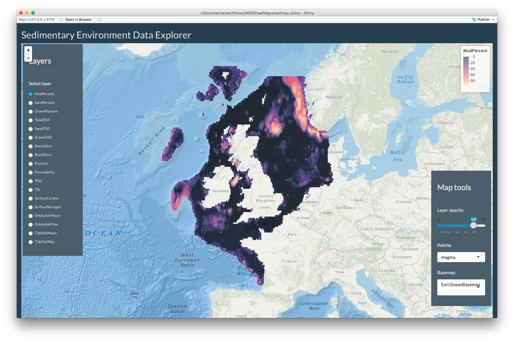

<!-- README.md is generated from README.Rmd. Please edit that file -->
sedMaps
=======

north-west European Shelf sedimentary environment
-------------------------------------------------

The goal of sedMaps is to provide **access, selection, summarising and visualisation** of raster **maps of the north-west European Shelf sedimentary environment** described in:

Wilson, R. J., Speirs, D. C., Sabatino, A., and Heath, M. R.: ***A synthetic map of the north-west European Shelf sedimentary environment for applications in marine science***, Earth Syst. Sci. Data, 10, 109-130, <https://doi.org/10.5194/essd-10-109-2018>, 2018

Abstract.
---------

Seabed sediment mapping is important for a wide range of marine policy, planning and scientific issues, and there has been considerable national and international investment around the world in the collation and synthesis of sediment datasets. However, in Europe at least, much of this effort has been directed towards seabed classification and mapping of discrete habitats. Scientific users often have to resort to reverse engineering these classifications to recover continuous variables, such as mud content and median grain size, that are required for many ecological and biophysical studies. Here we present a new set of 0.125° by 0.125° resolution synthetic maps of continuous properties of the north-west European sedimentary environment, extending from the Bay of Biscay to the northern limits of the North Sea and the Faroe Islands. The maps are a blend of gridded survey data, statistically modelled values based on distributions of bed shear stress due to tidal currents and waves, and bathymetric properties. Recent work has shown that statistical models can predict sediment composition in British waters and the North Sea with high accuracy, and here we extend this to the entire shelf and to the mapping of other key seabed parameters. The maps include percentage compositions of mud, sand and gravel; porosity and permeability; median grain size of the whole sediment and of the sand and the gravel fractions; carbon and nitrogen content of sediments; percentage of seabed area covered by rock; mean and maximum depth-averaged tidal velocity and wave orbital velocity at the seabed; and mean monthly natural disturbance rates. A number of applications for these maps exist, including species distribution modelling and the more accurate representation of sea-floor biogeochemistry in ecosystem models. The data products are available from <https://doi.org/10.15129/1e27b806-1eae-494d-83b5-a5f4792c46fc>.

Data
----

Data accessed: 2018-09-21 from: <https://pureportal.strath.ac.uk/en/datasets/data-for-a-synthetic-map-of-the-northwest-european-shelf-sediment>

### citation

Wilson, R. (Creator), Heath, M. (Contributor), Speirs, D. (Contributor), Sabatino, A. (Contributor). (8 Nov 2017): Data for: "A synthetic map of the northwest European Shelf sedimentary environment for applications in marine science", University of Strathclyde. data\_files\_csv(.zip), data\_files\_nc(.zip). 10.15129/1e27b806-1eae-494d-83b5-a5f4792c46fc

Data Explorer
-------------

The project will provide an interactive data app to visualise and extract data and summary statistics for sediment properties and monthly disturbance maps.

### Not live yet



To aid extraction, the app will offer ability to select data through:

-   range of relevant preloaded administrative and ecological vector data,
-   interactively through vector selection tools
-   loading of user vector data (with potential future support for raster masks).

Installation
------------

You can install the development version from [GitHub](https://github.com/) with:

``` r
# install.packages("devtools")
devtools::install_github("annakrystalli/sedMaps")
```

The functionality in the package is primarily associated with running the app
